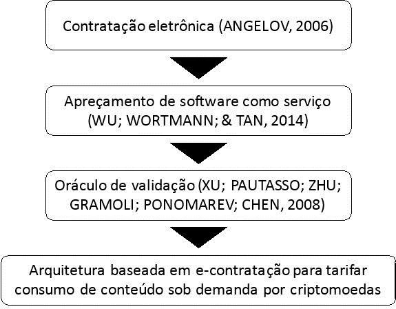
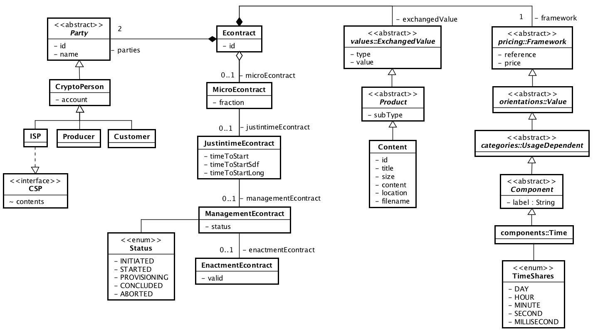
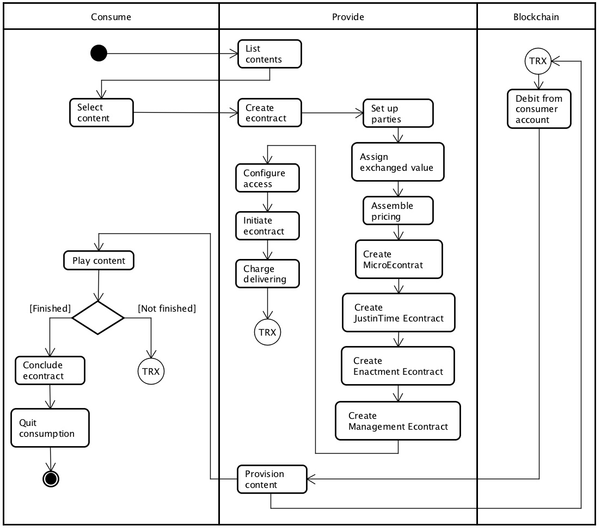
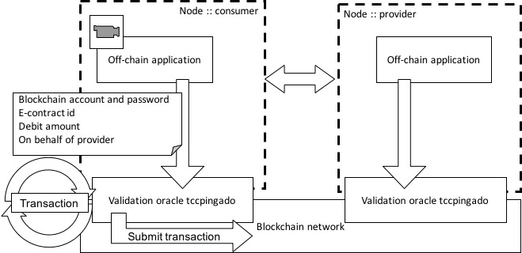
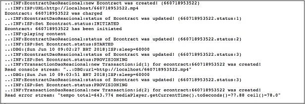

# Public - Bachelor's Thesis in Computer Science

# Proposal of an Architecture Based on E-Contracting to Charge by Cryptocurrencies On-demand Content Consumption

This is a public version of the work carried out for the production of the Bachelor's thesis in computer science at the Mackenzie Presbyterian Uniersity of an architecture based on e-contracting to charge by cryptocurrencies on-demand content consumption and defended in June 2018 by **Andre Miguel**.

### Auhtor, Supervisor
André Augusto Miguel (_`amigueltud (at) gmail.com`_), Ana Claudia Rossi (_`ana.rossi (at) mackenzie.br`_)

## Abstract

This article presents an architecture of electronic contracting to support
a system of provisioning streaming content and charge the consumption by
cryptocurrency payments, altogether with the framework of pricing over that
content. The context is the on demand video streaming rental. Currently companies
and amateur producers provide videos and charge their customers via
monthly payment or single rental per video; however, neither the possibility
for charging on demand, nor using cryptocurrencies for this purpose has being
explored. The architecture presented comprises the formatting of electronic
contracts and the price composition of the content being provided on demand to
be charged by cryptocurrency payments via blockchain distributed system.

## Introduction

The field of entertainment and the search for knowledge have always been motivated to
seek content in diverse sources. Nowadays the production of content in the internet is
abundant and its authors can host it either in specialized providers, such as YouTube,
SoundCloud, Spotify among others, or even themselves to own and transmit over their
private internet access. However, the remuneration for the consumption of this content
to the authors usually falls short of what they expected. The remuneration for the author
is normally determined by the host company. Hiring content for consumption is usually
not a formal process; it is often enough for the consumers to access the website where the
content is hosted, without being necessary to identify themselves. In this scenario, neither
the author nor the customer has influence on how much the author will receive from the
customer enjoying his or her work.

Cryptocurrencies provide a high level of reliability, security and publicity, thanks
to very well-developed mathematical constraints and algorithms that prevent fraud in the
system [[Xu et al. 2017]](#references). Therefore, as a means to reduce costs, universalize access and
speed up the transfer of values, it is observed that the use of cryptocurrencies has the
potential to be studied as an analogous and substitute method to bank transfers, in the
case of consumption of content on demand. The transfer of values can be achieved by
the integration with a blockchain distributed system network. However, trading is not just
about transferring values. The contracting and other definitions of the agreement are an
essential aspect to be considered in order to achieve the negotiation.

Therefore, to give control of the price charged by the media consumption to the
author, to streamline the contracting process and to facilitate the transfer of values, an
architecture is proposed that employs structures according to the electronic contracting
[[Angelov 2006]](#references) and pricing of Software-as-Service [[Wu et al. 2014]](#references) over the content.
The aim is to streamline the pricing and contracting of content on demand, to facilitate the
provisioning process and to integrate transfer of values into the process [[Xu et al. 2016]](#references).

## Theoretical Framework

The present study works with the framework of electronic contract elaboration of
[[Angelov 2006]](#references) and combines its paradigms to come into an adequate representation of
the contractual relationships on the supplying of content on demand; additionally, the
three-tier framework for software-as-a-service pricing of [[Wu et al. 2014]](#references) was used to
evaluate the best type of pricing. This is the basis on which it was studied the proposition
of an architecture to control the supply of media on demand and how the consumption of
the content can be charged efficiently.

Next, it was studied how the monetary values can be transferred in a more independent
form of regional and regulatory restrictions, through the use of channels of
distributed systems type blockchain network and its cryptocurrencies [[Xu et al. 2016]](#references).

Software system was produced as proof of concept of the employment of e-contracting
and pricing frameworks, which allowed to subsidize the proposed architecture
to effectively control contracting, supply of content on demand, and contract termination.
The form to charge consumption that was intended to demonstrate its feasibility is of
cryptocurrencies payments. Therefore, the formal conclusion of electronic contracts, the
form of appropriate pricing and the subsequent transfer of monetary resources through
cryptocurrency channels are the purpose of this research.

### Electronic Contracting

Contract is an instrument of obligations and rights in which both the parties contractor and
contracted agree. In current business environments, with new performance parameters
being demanded from companies, the dynamics of closing agreements has required more
and more agility and speed, so it is not appropriate to neglect any contractual aspect. Thus,
electronic contracting was introduced [[Angelov 2006]](#references) as a concept that reduces cost, time
and complexity, as opposed to paper contracts [[Angelov and Grefen 2014]](#references). E-contracts
are divided into shallow e-contracting, in which an e-mail exchange is already enough,
and deep e-contracting, which will be the subject of study of this research. The definition
of deep e-contracting [[Angelov and Grefen 2014]](#references) is: “_(1) Information technology is used
to aid the contracting process; (2) contracts have digital representation; (3) the level of
automation introduced by the use of information technology either leads to the creation of
new business processes in the organization or significantly changes existing processes_”.

### Pricing

Software-as-a-Service (SaaS) is offered such as it were a service and is hosted and accessed
across the internet. SaaS is at same time both a product and an outsourced service,
which means that both infrastructure and management are operated by the supplier
[[Wu et al. 2014]](#references). It is similar to a leasing, but, in the end, the contractor does not have
the product for himself. Likewise is the provision of media content on demand, in which,
in the end, the customer will not keep the media with him, he will only have enjoyed the
content. The proposed three-tier pricing was studied to understand how to be employed
in the research setting up.

### Blockchain

Blockchain is a distributed system closed on itself; nothing that is strange to the system
can enter the execution environment. The operation takes place in a decentralized and
transactional way and the data is shared by a network of untrusted participating nodes.
More generally, blockchain is a public domain ledger, maintained by all nodes of the cryptocurrency
network, which agree on the states of their operations [[Xu et al. 2016]](#references). Transactions
in the blockchain network are validated by defined rules and are encapsulated in
chained blocks, one after another in a process that is called “mining” [[Xu et al. 2017]](#references).

### Cryptocurrency

Cryptocurrency is a digital currency based on a point-to-point network and cryptographic
tools and is inherently independent of a central authority. This virtual money can be
transferred between users, directly, without the need of a constituted authority to authorize
the transaction [[Xu et al. 2016]](#references). Cryptocurrencies are the main product created by the
first generation of blockchain systems [[Xu et al. 2017]](#references). Cryptocurrencies do not need to
be notarized, that is, they do not have a holder who owns their property; they are a kind
of bearer title. The transactions, in turn, are registered and, similarly, notarized in the
blockchain network.

## Research Methodology

This work was based on applied research, with a qualitative approach, which sought to
understand how to circumvent the problem of dissatisfaction with the amount paid to
content producers by the consumption of their work. To do so, it was studied how to
employ the electronic contracting and pricing structures of SaaS, as well as to perform
electronic transfer of monetary units, to propose an architecture that would satisfy the
need to formal contracting the media consumption and subsequent payment. In addition,
with the bibliographical survey carried out, it was possible to gather material that would
subsidize the elaboration of the proposal of an architecture that could be attested by the
development of software as a proof of concept artifact.

The bibliography explored began by studying electronic contracting. In this regard,
the research of [[Angelov 2006]](#references) came to support all development of the proposed
architecture, since it is the formal contract that will establish the rights and obligations
between the parties. The concept groups and the paradigms of e-contracting were studied.

Next, the three levels of SaaS pricing framework from [[Wu et al. 2014]](#references) were studied,
since it was observed that the price should be properly defined to complete the e-contract
formatting. The analysis of price formation is given by orientation, in level 1 and
goes to categories, in level 2 and its specific components, in level 3.

Having completed the elaboration of the domain entities derived from the studies
on e-contracting and pricing (figure 2 and figure 3), it was defined how the transfer
of values should be carried out. It was chosen to transfer values in cryptocurrencies
by using a blockchain network with the element “validation oracle”, as presented by
[[Xu et al. 2016]](#references).

As a result, the proposed architecture could be built and had the proper proof of
concept developed in software that integrated the entire bibliographic reference.

##### • Conceptual model of contribution of bibliographic references

The e-contracting architecture to price on-demand content consumption by cryptocurrencies
is described by the relationships between the entities identified and the behavior
that they have to support the entire contracting, pricing, delivery, and monetary
transfer process.

## Architecture Based on E-Contracting to Charge by Cryptocurrencies On-demand Content Consumption

The Spiral Model of Software Development was used. Analysis, design and development
phases could be partitioned to have clearer objectives for each development cycle: 1.
Definition of objectives and alternatives; 2. Assessment of alternatives and proposal for
resolution; 3. Development and verification of software-prototype; 4. Planning the next
phase.

### E-Contract

E-contract is the starting point of the architecture; without this formal aspect it is not possible
to determine who the parties are, what will be transacted and at what price this will
be done. The e-contract for on-demand media content will essentially have the attributes:
contractor and contracted parties; exchange value object; price agreed.

As [[Angelov 2006]](#references) proposes the concept groups, the parties involved refer to who
consumes the content (contractor) and who supplies the content (contracted) and correspond
to the concept group “_Who_”; the exchanged value object refers to the content of the
media and the agreed price is the cost that the consumer party agrees to pay the provider
for the exchanged value object and both correspond to the concept group “_What_”. There
are also the “_When_” concept group, which refers to when content will be provided; “_How_”
and “Where” cover how the contract is drawn up and where it will took place.

However, despite essential, these e-contract terms do not satisfy all the complexity
inherent to the activity of delivering on-demand media content. The adoption of deep
e-contract paradigms [[Angelov and Grefen 2014]](#references) leads to opportunities that the organization
can take advantage of. Therefore, to format the e-contract, it was studied the
paradigms and their aspects [[Angelov and Grefen 2014]](#references), as shown in the table 1:

##### • Paradigms of deep e-contract and its aspects
| **Paradigm*** | **Aspect** |
|-|-|
| µ-contract (_micro-contract_) | Mass customization, financial |
| τ-contract (just-in-time-contract) | Agility, life cycle |
| π-contract (precision-contract) | Quality |
| ϵ-contract (enactment-contract) | Strategic IT Architecture |
| γ-contract (management-contract) | Management Information |
* _lowercase greek letters: “Mi” µ; “Tau” τ ; “Pi” π; “psilon” ϵ; and “Gama” γ._

The e-contract paradigms were analyzed as follows:
* µ-contract paradigm determines the fraction of time the “charging cycle” will occur
and is used in conjunction with the price structure. Charging cycle is the time
it takes to perform new charging.
* τ -contract paradigm determines the timing of execution of on-demand delivery.
* ϵ-contract and γ-contract paradigms are essential to control the execution of the
e-contract and it was possible to keep them both simplified. The ϵ-contract determines
whether the e-contract is valid or invalid; the γ-contract specifies the current
state within a set of possible states for the e-contract.
* π-contract paradigm has the function of checking redundancy of clauses.

In order to associate the paradigms, it was verified that the price must be previously
defined, as well as how the charging would be realized. Therefore, the three-level
pricing framework of SaaS [[Wu et al. 2014]](#references) has been studied to determine the best price
composition.

The analysis of the exchanged object has led to the understanding that the Contracted
Product is a Good that is being rented and not a Service that is being provided,
as if it were a DVD media rented at the video store. It’s not a service, such as you’re
watching a movie at the movie theater.

### Price

The analysis of price formation took place from level 1, orientation by cost. At this point,
it has been observed that the subsequent levels of category and component are related to
elements that are not part of the scope of this research, such as, “Usage Independent”
category, which is related to nominal order components such as access rules and number
of concurrent users; and also in the “Service” category, where there are components such
as backup and helpdesk services.

When analyzing the orientation by value, it is observed that the categories can be
more or less relevant to the context of the research and fit within its scope. Given that the
purpose is to make payments on demand, the possibilities provided by the components of
the categories derived from value orientation were explored:
* “Payment” category stipulates that payments are made on a recurring basis
(monthly or weekly, for example), or in a batch: it is not context-relevant because
it is more in line with the traditional monthly payment format (i.e. Netflix)
or rent for a certain time (i.e. Net NOW).
* Components within “Product” category refer to functionality, packaging with different
options, location or other segmentation: it is not relevant to the context for
the same reason that it fits more the traditional format.
* “Usage Dependent” category components, such as the “Memory/Band” component
refers to resource usage and has no relevance to the context. The “Transaction”
component could be included but does not objectively satisfy the requirement
to charge on demand, as the transaction needs to be matched to some unit or
amount of time and there is a specific component for this purpose; moreover, the
transaction is, for all intents and purposes, considered an indivisible atomic event.
The unit of time is established in the “Time” component, so it is better suited to
on-demand charging.

Through this analysis, it was established that the price structure adopted should
be: Orientation: Value; Category: Usage Dependent; Component: Time; or simply
Value-Usage-Time. Given this, it can be already specified which unit of time is measured and
how many units will be counted for each on-demand charging cycle.

### E-Contract Construction

The Value-Usage-Time pricing structure was used combined with the µ-contract paradigm
to define the fraction of time charged. The µ-contract allows for mass customization, that
is, each e-contract can have specific characteristics of the negotiation. In the case of this
research, the µ-contract refers only to how many units of the fraction of time will be used
in each charging cycle. This aptitude for mass customization creates the opportunity to
have a variety of contracts with different fractions of time specifications and units of time
to complete the billing cycle. The fractions of time that have been identified are: _DAY_,
_HOUR_, _MINUTE_, _SECOND_, _MILISSECOND_.

Next, the other paradigms are associated. τ -contract establishes the exact moment
when the e-contract should be started and will normally be given soon after its establishment.
This leads to a time reduction in the effectiveness of the fulfillment of the
e-contract.

The ϵ-contract is used as an indication of the validity of the e-contract; it is through
it that the systems check whether the e-contract can be started or continue to be provisioned.
The systems evaluate the conditions for compliance and determine whether or not
the contract is valid. This leads to the opportunity to fulfill more and more quickly and
accurately an increasing number of e-contracts.

The γ-contract maintains the current status of the e-contract, which enables better
management of its execution. Systems will interpret and manipulate this state, according
to defined rules. This reduces several risks, such as defaults and “negative credit”
(customer enjoying the content without having credits to pay for it). Possible states that
have been identified are: _INITIATED_, _STARTED_, _PROVISIONING_, _CONCLUDED_ and
_ABORTED_.

The π-contract was not employed because its objective utility is to improve the
quality of the e-contract itself, avoiding redundant clauses, omissions and inconsistencies
[[Angelov and Grefen 2014]](#references). It is not necessary at this moment, since the sought for the
fulfillment of the contract is simplicity amidst the complexity of the components involved
in the process.

###  Entities and Architecture Behavior

The proposed architecture has the following domain entities:

##### • Analysis Class Diagram

These entities are the basis for all the proof-of-concept development; the whole
system orbits around them. The behavior of the architecture can be described by the
activity diagram.

### Monetary Transfer
Given that the entities and their behaviors were defined, we set out to analyze how to implement
the monetary transfer. The idea is to prepare the architecture for the globalized
world. Thus, the form of payments chosen to concentrate the studies was cryptocurrencies
transactions via blockchain network. To integrate blockchain into any system, you need
to create a resource that stands at the border between systems. This is called a “validation
oracle” (figure 4) and it is through this element that the transfer of monetary values from a
valid account in the blockchain network is authorized to make the debit of the cryptocurrency
value from its wallet to another valid beneficiary account [[Xu et al. 2016]](#references).

##### • Activity Diagram

The “communication service” from the validation oracle has been implemented,
which makes the transfer of data recorded by a transaction. Here is carried out the transfer
of cryptocurrencies from the consumer’s account to the producer’s account, both valid in
the blockchain network. At each new charging cycle, the customer sends a debit command
to the architecture’s validation oracle, which will serve to authorize a new charging cycle
and continue provisioning.

## Discussion of Results

The deep e-contract paradigms employed enabled the creation of varied personalization
of contractual parameters, which can be configured to fit each situation. The µ-contract
paradigm concentrates reference data for charging; τ -contract holds the time when provisioning
should begin; ϵ-contract determines whether the e-contract is valid; and γ-contract
holds information on the state the e-contract is at the moment. Figure 5 displays a sample
of e-contract manipulation.

The software-as-a-service price structure identified is handled associated with µ-contract
and is used to determine the charging cycle time to make the transfer of values,
by the debit of monetary units, represented by cryptocurrencies. With this, it was possible
to integrate the transfer of cryptocurrencies via the blockchain network, throughout the
validation oracle.

##### • Validation Oracle

To complete the proof-of-concept development, a module of software was developed
to execute the video transmission and it could be integrated to the architecture,
providing data regarding execution and feeding the e-contract validation mechanisms.
Other modules were created: TCP/IP gateway to receive commands from the architecture
and send them to the validation oracle; also the transmission to the blockchain network
constituted a separate module.

##### • Log from the Provisioning Console

Both architecture and other modules of software were developed in Java language
(can be found in this GitHub repository. Other systems integrations were realized with Derby database
system; distributed blockchain network system Ethereum and its cryptocurrency ether;
and Apache web server, all running on the MacOS operating system over a Macbook Pro
2.9 GHz Intel Core i5, 8 GB RAM.

## Conclusions and Recommendations

It was possible to achieve the objectives of the research and to create an architecture
based on e-contracting to charge consumption of content on demand by cryptocurrencies.
An artifact of proof of concept was developed to employ SaaS e-contracting and pricing
frameworks to deliver on-demand content via the internet; it was integrated with media ex-
ecution software, web server, database server and blockchain network. As demonstrated,
the possibility of giving the author producer control over the price he wants to charge for
its contents was created.

For future works, it is possible to extend the mechanics of price formation, insert-
ing the negotiation functionality between the producer and the consumer, giving the latter
the possibility of effectively tell how much he is willing to pay; there is also the possi-
bility of combining price components, making the architecture more flexible and generic,
which would extend the architecture’s reach to other products and markets; implement the
transfer of values via _smart contracts_, making it more transparent and precise, and may
also employ the π-contract paradigm, which was not used in this research; more refined
provisioning and pricing, as a way of avoiding monetary losses and supply disruptions.

Consider including new attributes in the paradigms of deep e-contracting, to become
more adherent with its aspects.

Implement the “coordination service” of the validation oracle, which will be used
to support _smart contracts_.

With the application of these improvements, it is intended to transform the proposed
architecture into a wider and extensive API that can be used for charging in several
scenarios.

## References

* Angelov, S. (2006). _Foundations of b2b electronic contracting_. Technische Universiteit Eindhoven.
* Angelov, S. and Grefen, P. (2014). The business case for b2b e-contracting. _In ICEC ’04 Proceedings of the 6th international conference on Electronic Commerce_, pages 31–40. ACM.
* Wu, S., Wortmann, H., and Tan, C. (2014). A pricing framework for software-as-a- service. _In 2014 Fourth International Conference on Innovative Computing Technology (INTECH)_, pages 152–157. IEEE.
* Xu, X., Pautasso, C., Zhu, L., Gramoli, V., Ponomarev, A., and Shen, S. (2016). The blockchain as a software connector. _In 2016 13th Working IEEE/IFIP Conference on Software Architecture_, pages 182–191. IEEE.
* Xu, X., Weber, I., Staples, M., Zhu, L., Bosch, J., Bass, L., Pautasso, C., and Rimba, P. (2017). A taxonomy of blockchain-based systems for architecture design. _In 2017 IEEE International Conference on Software Architecture_, pages 243–252. IEEE.
* 
